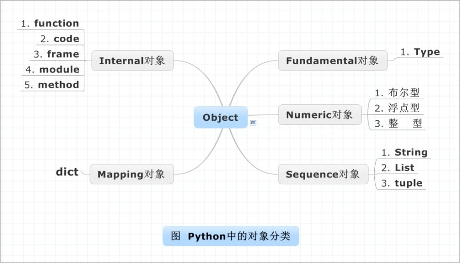

[TOC]

### 直击灵魂的问题

python是怎么将模块编译成对象的？

# python对象探究

## PyObject：对象系统的基石

### 包含哪些数据？

- 引用计数

- 类型对象（指向对象类型）

## PyTypeObject：PyObject中的第二个数据成员

### 组成成分？

- 类型名
- 占用内存大小
- 类型支持的操作
- 类型信息

### 类型对象的创建

**两种方式？**

- 通过C的多态机制创建类型
- 通过特定接口创建相应类型

### 类型行为: PyTypeObject的3种基本操作族

tp_as_number, tp_as_sequence,tp_as_mapping，不同的操作族中包含不同的函数指针，定义了不同的类型特性。

### 混合类型对象的行为？

通过实现类型的相关魔法函数，让python内部去指定函数指针。PyTypeObject允许一种类型同时指定不同对象的行为特性。

## 万物皆对象？

### 类型对象对应的类型：PyType_Type

所有自定义class所对应的PyTypeObject对象都是通过PyType_Type这个对象创建的。

PyType_Type也被成为metaclass

### 类型之间的关系

### Python对象的多态性

Python通过`PyObject` + `PyTypeObject`结合C实现了多态，在创建对象后，Python会使用`PyObject*` 来储存对象，python内部函数之间传递的都是这种泛型指针，只有通过指针所指对象的`ob_type`域才能动态确定类型。

### 引用计数

在一个对象的引用计数变为0的时候，会调用其析构函数，但并不意味着释放其内存空间，通常是将其占用的内存归还到内存池。

python假设一个对象的引用计数不会大于32位整形变量

特别的，类型对象永远不会被析构，对象指向类型对象的指针也不为视为引用。

## Python对象的分类

额外解释：

Fundamental对象：类型对象

Internal对象：虚拟机运行时内部使用的对象

## 回顾开头问题

从上图我们看到模块对象是由虚拟机在运行时创建出来的对象，所以在我们了解虚拟机运行时做了什么之前，暂时无法完整回答这个问题。