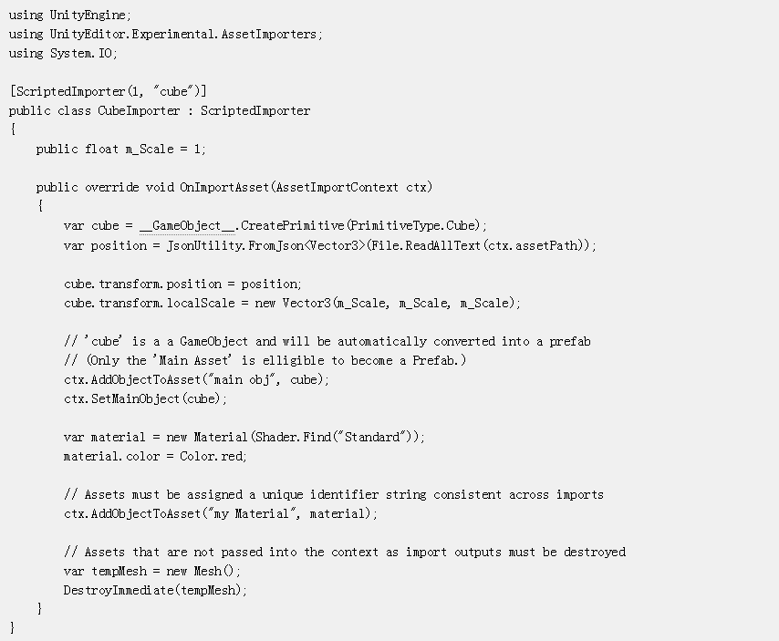

### 有什么用？

当特殊（非Unity原生支持的资产类型）导入到Unity后，我们可以使用`ScriptedImporter`，去定制导入流程。

### 示例

假设导入了一个cube后缀的资产，unity监听到了资产导入，我们通过复写[OnImportAsset](https://docs.unity3d.com/2018.4/Documentation/ScriptReference/Experimental.AssetImporters.ScriptedImporter.OnImportAsset.html)函数，将他创建为Prefab并添加一系列组件。

当然除了资源的自定导入之外，也可以自定资源的显示。比如：

## 使用Scripted Importer

当你给你工程添加了一个`Scripted Importer`之后，你就可以像使用其他原生资源一样使用Unity相关支持，比如：

- 会把被支持的资源显示在Asset目录的层次结构中
- 重新启动编辑器的时候，会和其他原生资源类型一样，检查是否有新的更新或者升级
- 在磁盘上编辑了资产文件，再回到Unity会触发资源重导入。
- 可以使用`Asset->Import New Asset…` 来创建新资源
- 可以被`Asset -> Reimport` 触发
- 点击某个资产，可以在Inspector窗口查看相关属性，如果修改了某些设置会触发窗口的Apply按钮。

### 相关类

自定义导入器  ---继承自---> `Scripted Importer`   ---继承自--->  `AssetImporter`

可以为导入器自定义面板（即编辑器扩展)：

自定义导入器面板  	---继承自--->   `AssetImporterEditor`

### 代码修改导入对象的设置

1. 获取对应的Importer
2. 修改参数
3. 调用`AssetDatabase.Refresh`

### 参考

[官方手册](https://docs.unity3d.com/Manual/ScriptedImporters.html)