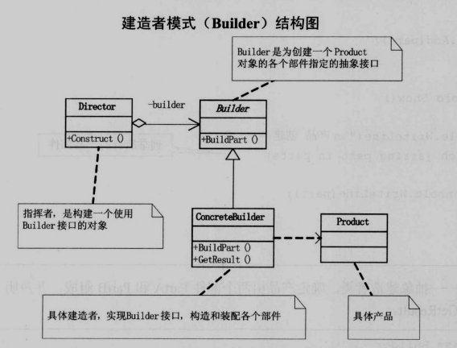

#### 结构



#### 说明

简单来说就是<u> 封装一个对象的构造过程</u>，并允许按步骤构造。
意图：将一个复杂的构建与其表示相分离，使得**同样的构建过程可以创建不同的表示**。

主要解决：主要解决在软件系统中，有时候面临着"一个复杂对象"的创建工作，其通常由各个部分的子对象用一定的算法构成；
- 由于需求的变化，这个复杂对象的各个部分经常面临着剧烈的变化，但是将它们组合在一起的算法却相对稳定。

何时使用：一些基本部件不会变，而其组合经常变化的时候。

如何解决：将变与不变分离开。

生活中的例子： 1、去肯德基，汉堡、可乐、薯条、炸鸡翅等是不变的，而其组合是经常变化的，生成出所谓的"套餐"。

优点： 1、建造者独立，易扩展。
      2、便于控制细节风险。

缺点： 1、产品必须有共同点，范围有限制。 
      2、如内部变化复杂，会有很多的建造类。

使用场景： 1、需要生成的对象具有复杂的内部结构。 
          2、需要生成的对象内部属性本身相互依赖。

生活中的例子：
      pattern工厂领导突发奇想，在每个分工厂制备几台打包机、将不同糖果打包、推出糖果礼包，结果在节假日广受好评。

注意事项：
- 与工厂模式的区别是：工厂模式最终通过**不同的子类工厂**创建不同产品；建造者模式通过**重用建造组合**或**不同的建造者**创建不同产品。
- 与抽象工厂的区别：建造者模式最终获得的是一个拥有零件容器的**单一对象**；抽象工厂则是创建产品家族中的某个单一对象。

应用举例：
Android中创建一个dialog
``` C#
new AlertDialog.Builder(this).setCancelable(true)
        .setIcon(R.mipmap.app_logo).setMessage("温馨提醒").show();
```