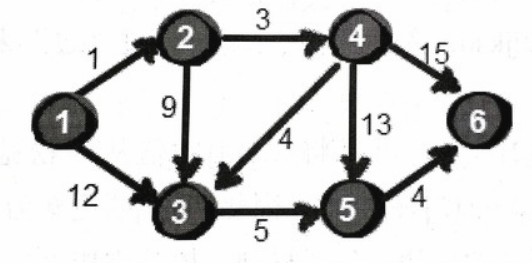

## 解决什么问题

给定一个有向加权图`G(V,E)` 和 一个源节点`s`，求源节点到其他各节点的最短路径。

## 经典算法

- Dijkstra  - 有向加权图中求一个源点到其他节点的最短路
- Bellman-Ford - 增加处理负边权问题
- 队列优化的Bellman-Ford
- Floyd-Warshall - 有向加权图中求任意两点间的最短路

## 储存图的数据结构

- 邻接矩阵
- 邻接表

## 术语：松弛

从源节点出发寻找周围最近节点后，经过此节点到达的后续节点能被更新出更短的路径。

以上图为例：1 -> 3 直接走花费是12；1 -> 2 - > 3却只要10。这就能说1去往3的路径被“松弛”了。

### 约定

通常将`s` -> `s`的花费算作0; 到不可达节点的花费算作正无穷。

## 基础dijkstra算法

### 辅助容器

- 队列：用来暂存图上需要走的节点，

- `lShortestDis[u]` :  源点到索引节点的最短距离，当前索引`u`表示最优路径上的节点。（列表值会不断被松弛更新）

  >初始化： u == s, `lShortestDis[u]` = 0; 否则 `lShortestDis[u]` = +∞

- lPreNode[u] :  当前索引节点的前一个节点，当前索引`u`表示最优路径上的节点。可以用这个数组去生成最短路路径。

### 概括

Dijkstra是一种基于贪心策略的算法。每次新扩展一个路径最短的点，更新与它相邻的所有点。当所有边权为正时，由于不会存在一个路程更短的没扩展过的点，所以这个点的路程就确定下来了，这保证了算法的正确性。

但也正因为这样，这个算法**不能处理负权边**，因为扩展到负权边的时候会产生更短的路径，有可能破坏了已经更新的点路程不会改变的性质。

`具体代码见：Implement/dijkstra`