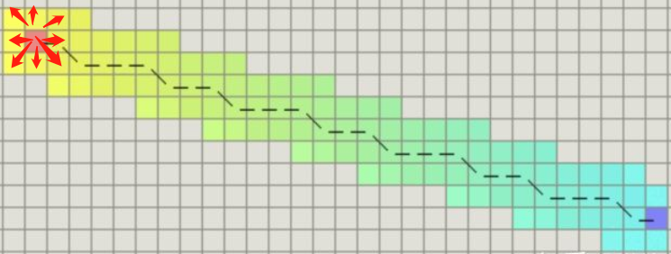

## 提要

A星算法有个如雷灌而的公式：`F(n)= G(n) + H(n)`，这个公式被称之为启发函数，用来选择下一个要走的点。

那么这个公式中的`函数G` 和 `函数H`代表的是什么呢？

- G(n)：计算当前点到起点的距离

这个函数的选点思路代表的是**迪杰斯特拉算法**的核心思路：

> 每次选择距离起点最近的点作为写一个目标

- H(n)：计算当前点到终点的距离

这个函数的选点思路是**最佳优先搜索算法**的核心思路：

> 每次选择距离终点最近的点作为下一个目标

- 结合起来，A星算法的寻点路径的核心思路为：

> 寻找某个点作为下一个目标点，这个点距离起点与终点的距离和最小

### A星算法解决什么问题

- 迪杰斯特拉算法是通过广度优先搜索的方式去向四周扩张，直到接触到终点。此间存在搜索范围大，耗时的问题。但是最终的到的路径一定是最短路径。
- 最佳优先算法是以目标为导向的，速度快，但是最终得到的路径不一定是最短路径。
- A星通过增加一个比例系数，调节这两种算法对最终结果的影响比重。比如：在起点和终点中间有大量障碍时增大G函数的比例；反之增大H函数的比例。

### A星算法描述

```text
* 初始化open_set和close_set；
* 将起点加入open_set中，并设置优先级为0（优先级最高）；
* 如果open_set不为空，则从open_set中选取优先级最高的节点n：
    * 如果节点n为终点，则：
        * 从终点开始逐步追踪parent节点，一直达到起点；
        * 返回找到的结果路径，算法结束；
    * 如果节点n不是终点，则：
        * 将节点n从open_set中删除，并加入close_set中；
        * 遍历节点n所有的邻近节点：
            * 如果邻近节点m在close_set中，则：
                * 跳过，选取下一个邻近节点
            * 如果邻近节点m在open_set中，则：
                * 判断节点n到节点m的 F(n) + cost[n,m] 值是否 < 节点m的 F(m) 。来尝试更新m点，重新设置f值和父节点等数据
            * 如果邻近节点m也不在open_set中，则：
                * 设置节点m的parent为节点n
                * 计算节点m的优先级
                * 将节点m加入open_set中
```

### 关于距离

前文提到的点到点的距离，由几种选项，需要视情况而定：

- 曼哈顿距离：如果每次移动只能朝上下左右四个方向移动

  

- 对角距离：如果允许朝八个方向移动

  

- 欧几里得距离：不存在格子的限制，直接两点之间直线最短

  

  

  

  

  